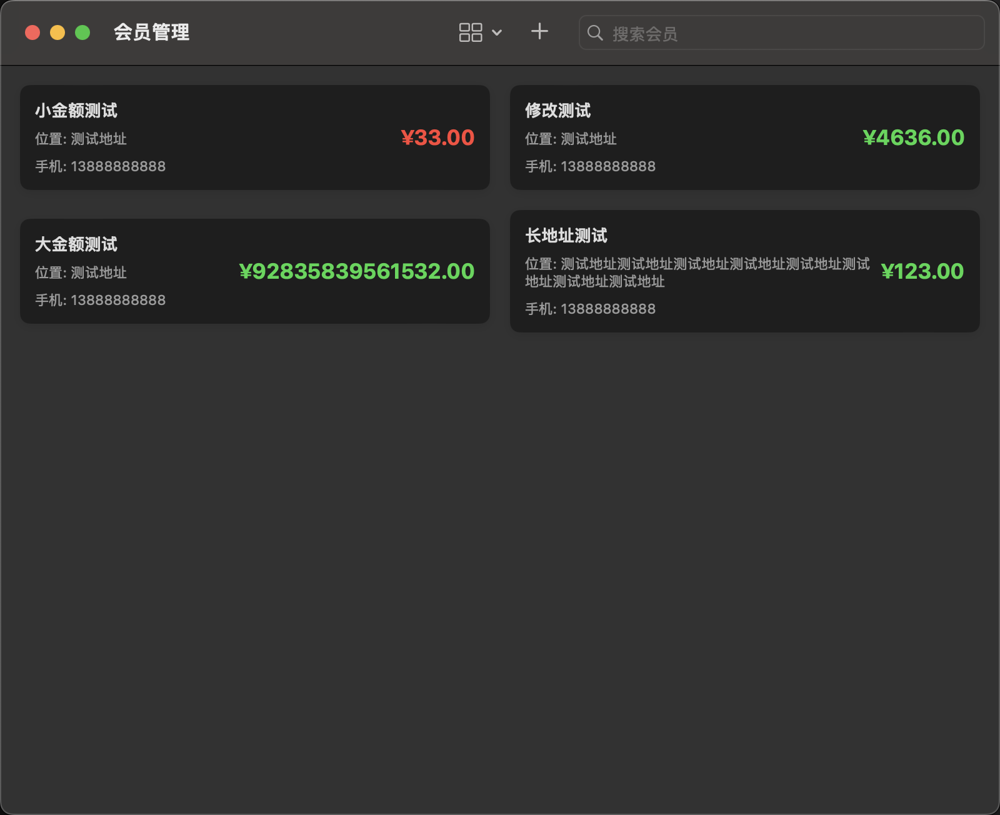

# VIP Manager

VIP Manager 是一个用 SwiftUI 开发的跨平台（iOS/macOS）会员管理应用，用于管理店铺会员信息和余额。

## 功能特点

- 🔄 跨平台支持：同时支持 iOS 和 macOS
- 📱 响应式设计：自适应不同屏幕尺寸
- 🎨 现代化 UI：符合 Apple 设计规范
- 🔍 实时搜索：快速查找会员信息
- 💳 余额管理：直观的余额显示和预警
- 📊 灵活布局：支持单列/双列显示切换

### 核心功能

1. 会员管理
   - 添加新会员
   - 编辑会员信息
   - 删除会员
   - 余额预警（低于50元显示红色）

2. 数据存储
   - 本地持久化存储
   - 自动保存
   - 数据同步

3. 搜索功能
   - 店铺名称搜索
   - 位置搜索
   - 手机号搜索

## 技术栈

- SwiftUI
- Combine
- Swift Concurrency
- FileManager

## 系统要求

- iOS 15.0+ / macOS 12.0+
- Xcode 14.0+
- Swift 5.5+

